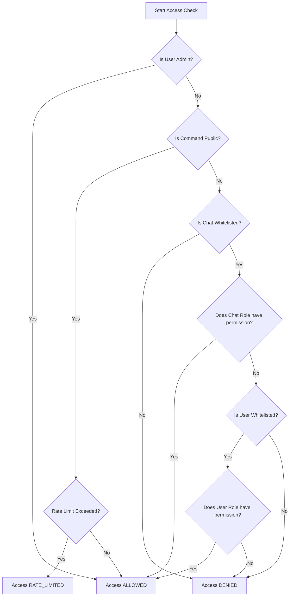

# Role-Based Access Control (RBAC) in Daphne

Daphne features a multi-tenant Role-Based Access Control (RBAC) mechanism to secure command execution. It restricts access based on both the requesting user and the chat (group/channel/direct message) context.

---

## 1. Access Evaluation Flow

When a user triggers a command (e.g., `/fix`, `/audio`), Daphne's [RbacService](file:///home/haru/Projects/project-github/daphne/src/daphne/rbac.py#L31) evaluates access in the following order:



### Evaluation Hierarchy:
1. **Admin Bypass**: If the user is whitelisted with the `"admin"` role, access is granted unconditionally.
2. **Public Commands**: If the command is listed in `public_commands`, access is granted to all users, subject to rate limits.
3. **Chat Whitelist Enforcement**: The chat/group must be whitelisted in the configuration. If the chat ID is not found, access is immediately denied.
4. **Chat-Level Permission Fallback**: If the chat's role is granted permission for the command, **all users** in that chat are allowed to run it.
5. **User-Level Permission**: If the chat's role does not grant permission, but the user is individually whitelisted and their user role has permission, access is granted.
6. **Denial**: If none of the conditions above are met, the request is denied.

---

## 2. Configuration (`config.toml`)

The RBAC system is configured under the `[rbac]` section of the configuration file.

### Complete Configuration Example
```toml
[rbac]
# Commands accessible by anyone in any chat (subject to rate limiting)
public_commands = ["help"]

# Resource quotas (rolling 1-hour window)
convert_link_limit = 60
extract_audio_limit = 10
download_video_limit = 5
preview_video_limit = 10
fetch_metadata_limit = 30

# Define roles and their permitted commands
[rbac.roles.admin]
permissions = ["*"] # Asterisk allows all commands

[rbac.roles.standard_group]
permissions = ["convert_link", "extract_audio", "preview_video", "download_video", "fetch_metadata"]

[rbac.roles.restricted_user]
permissions = ["convert_link"]

# Map specific Telegram user IDs to roles
[rbac.users]
996596491 = "admin" # Owner
123456789 = "restricted_user"

# Map Telegram chat/group/channel IDs to roles
[rbac.chats]
# average anime fan boy (Group Chat)
-1002058191932 = "standard_group"
# Direct Message test chat
-1003438236939 = "standard_group"
```

---

## 3. Reference of Commands and Permissions

| Command | Permission Name | Description |
| :--- | :--- | :--- |
| `help` | `help` | Outputs the bot help instructions and usage limits. |
| (Link detection / `/fix`) | `convert_link` | Converts social media links (Twitter, Pixiv, Bluesky, TikTok, Instagram) into native Telegram media. |
| `/audio <link>` | `extract_audio` | Extracts audio tracks from video files and outputs an MP3. |
| (Video callback query) | `download_video` | Downloads and converts generic video links (YouTube, Bilibili) on-demand. |
| (Video auto-preview) | `preview_video` | Automatically downloads and uploads video natively if under size limit. |
| (Video link detection) | `fetch_metadata` | Fetches metadata for video links and generates a preview info card with a download button. |

---

## 4. Rate Limiting for Public Commands

Public commands are rate-limited per user to prevent denial-of-service attempts.
- **Limit**: Maximum 10 calls per rolling 60-second window.
- **Exceeding**: Daphne returns `AccessStatus.RATE_LIMITED` and logs the warning.
