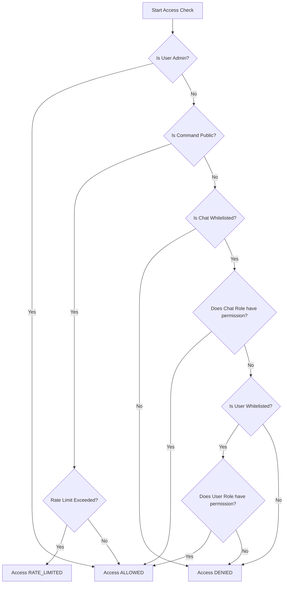

# Role-Based Access Control (RBAC) in Daphne

Daphne features a multi-tenant Role-Based Access Control (RBAC) mechanism to secure commands, link conversion, inline queries, and callback downloads. It restricts access based on both the requesting user and the chat (group/channel/direct message) context.

---

## 1. Access Evaluation Flow

When a user triggers a command (e.g., `/gallery`, `/audio`), Daphne's [RbacService](src/daphne/rbac.py#L31) evaluates access in the following order:


```mermaid
graph TD
    A[Start Access Check] --> B{Is User Admin?}
    B -- Yes --> C[Access ALLOWED]
    B -- No --> D{Is Command Public?}
    D -- Yes --> E{Rate Limit Exceeded?}
    E -- Yes --> F[Access RATE_LIMITED]
    E -- No --> C
    D -- No --> G{Is Chat Whitelisted?}
    G -- No --> H[Access DENIED]
    G -- Yes --> I{Does Chat Role have permission?}
    I -- Yes --> C
    I -- No --> J{Is User Whitelisted?}
    J -- Yes --> K{Does User Role have permission?}
    K -- Yes --> C
    K -- No --> H
    J -- No --> H
```

### Evaluation Hierarchy:
1. **Admin Bypass**: If the user is whitelisted with the `"admin"` role, access is granted unconditionally.
2. **Public Commands**: If the command is listed in `public_commands`, access is granted to all users, subject to rate limits.
3. **Chat Whitelist Enforcement**: The chat/group must be whitelisted in the configuration. If the chat ID is not found, access is immediately denied.
4. **Chat-Level Permission Fallback**: If the chat's role is granted permission for the command, **all users** in that chat are allowed to run it.
5. **User-Level Permission**: If the chat's role does not grant permission, but the user is individually whitelisted and their user role has permission, access is granted.
6. **Inline Queries**: Inline queries have no chat context, so Daphne checks `inline_convert` against the user role with `chat_id = 0`; chat roles cannot authorize inline mode.
7. **Denial**: If none of the conditions above are met, the request is denied.

---

## 2. Configuration (`config.toml`)

The RBAC system is configured under the `[rbac]` section of the configuration file.

### Complete Configuration Example
```toml
[rbac]
# Commands accessible by anyone in any chat (subject to rate limiting)
public_commands = ["help"]

# Resource quotas (rolling 1-hour window)
convert_link_limit = 60
extract_audio_limit = 10
download_video_limit = 5
preview_video_limit = 10
fetch_metadata_limit = 30

# Define roles and their permitted commands — a graduated ladder from
# minimal to full, rather than one broad "standard" tier for everyone.
[rbac.roles.admin]
permissions = ["*"] # Asterisk allows all commands

[rbac.roles.default]
permissions = ["convert_link"]

[rbac.roles.standard]
permissions = ["convert_link", "preview_video", "fetch_metadata", "extract_audio"]

[rbac.roles.power_user]
permissions = ["convert_link", "preview_video", "fetch_metadata", "extract_audio", "download_video"]

[rbac.roles.inline_user]
permissions = ["inline_convert"]

# Map specific Telegram user IDs to roles
[rbac.users]
111111111 = "admin" # Replace with your Telegram user ID
222222222 = "default"

# Map Telegram chat/group/channel IDs to roles
[rbac.chats]
# average anime fan boy (Group Chat)
-1001111111111 = "power_user"
# Direct Message test chat
-1002222222222 = "standard"
```

---

## 3. Reference of Commands and Permissions

| Command | Permission Name | Description |
| :--- | :--- | :--- |
| `help` | `help` | Outputs the bot help instructions and usage limits. |
| (Link detection / `/fix`) | `convert_link` | Converts social media links (Twitter, Pixiv, Bluesky, TikTok, Instagram, Reddit) into native Telegram media. |
| `/audio <link>` | `extract_audio` | Extracts audio tracks from video files and outputs an MP3. |
| (Video callback query) | `download_video` | Downloads and converts generic video links (YouTube, Bilibili) on-demand. |
| (Video auto-preview) | `preview_video` | Automatically downloads and uploads video natively if under size limit. |
| (Video link detection) | `fetch_metadata` | Fetches metadata for video links and generates a preview info card with a download button. |
| `/gallery <link>` | `download_gallery` | Downloads an image gallery and sends it as chunked Telegram media groups. |
| `@daphne <link>` | `inline_convert` | Resolves supported Twitter/X, Instagram, and YouTube/Bilibili links in inline mode. User-level permission only. |

---

## 4. Rate Limiting for Public Commands

Public commands are rate-limited per user to prevent denial-of-service attempts.
- **Limit**: Maximum 10 calls per rolling 60-second window.
- **Exceeding**: Daphne returns `AccessStatus.RATE_LIMITED` and logs the warning.

---

## 5. Live Edits: `/grant`, `/revoke`, `/roles`

By default, changing RBAC means editing `config.toml` and restarting. Admins
(role `"admin"`) can instead edit roles live from Telegram:

| Command | Effect |
| :--- | :--- |
| `/roles` | Lists configured role names and their permissions. |
| `/grant <role>` (reply to a message) | Grants `<role>` to the replied-to user. |
| `/grant <role>` (no reply) | Grants `<role>` to the current chat. |
| `/revoke` (reply to a message) | Removes the replied-to user's role. |
| `/revoke` (no reply) | Removes the current chat's role. |

These three commands are hardcoded to the `admin` role check — they can never
be unlocked by listing `"grant"`, `"revoke"`, or `"roles"` in a role's
`permissions`, and they are intentionally left out of the Telegram `/` command
menu so non-admins don't see them.

**Persistence**: without a Valkey URL configured, grants/revokes are
in-memory only and reset on restart. Set `[rbac] valkey_url = "redis://..."`
(or the `DAPHNE_VALKEY_URL` env var, which takes precedence and keeps
credentials out of the git-tracked config) to persist them and pick up edits
made directly in Valkey — the bot refreshes from Valkey every 30 seconds and
once at startup. `config.toml` remains the fallback and, on first boot with
an empty Valkey store, seeds it. Valkey key layout: `daphne:rbac:roles`,
`daphne:rbac:users`, `daphne:rbac:chats`, `daphne:rbac:public_commands`,
namespaced so other self-hosted bots can share the same Valkey instance.
